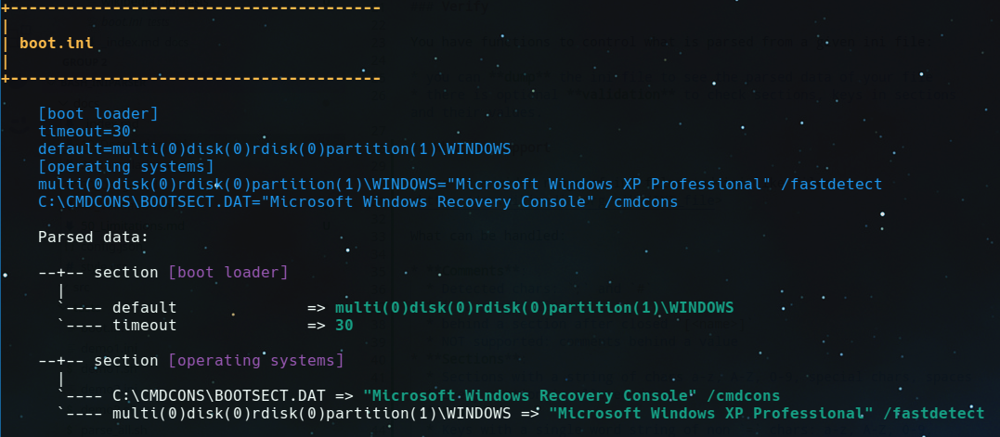

# Axels Bash INI parser

A class like component to access values of an ini file 
in your Bash scripts or to validate it.

You want a value from a file within a given section? `ini.value "<inifile>" "<section>" "<key>"` returns it.

---

👤 Author: Axel Hahn\
🧾 Source: <https://github.com/axelhahn/bash_iniparser/>\
📜 License: GNU GPL 3.0\
📗 Docs: see <https://www.axel-hahn.de/docs/bash_iniparser/>

## Screenshot

