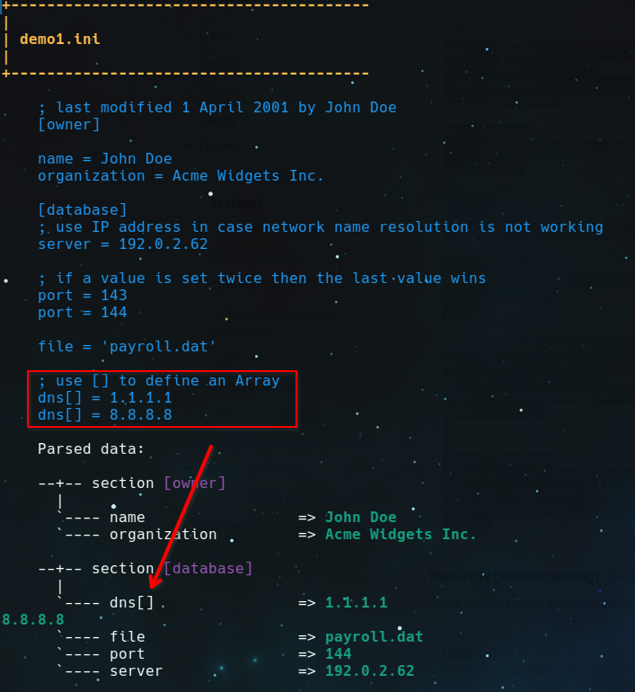

## What is it?

This project is written in Bash. 

The main features are around reading sections and values from an INI file. 

### Read data

This component offers functions to get

* a list of existing sections
* a list of variables in a given section
* values of a value in a given section 

You can get values as 

* integer
* string
* arrays as multiline strings

### Verify

You have functions to control what is parsed from a given ini file:

* you can **dump** the ini file to see the parsed data of your file
* there is optional **validation** to check sections, keys in sections and their values.

## What we support

There is a wider range of ini files and ini like files. See <https://en.wikipedia.org/wiki/INI_file>. It is not possible to support all complexity - but a good compromise.

What can be handled:

* **Comments**:
  * Detected chars: `;` and `#`
  * Must be in a single line
  * Are allowed behind a section after closed bracket, eg. `[<name>] # my comment`
  * NOT supported: comments behind a value
* **Sections**:
  * Sections with a string of chars a-z, A-Z, 0-9, special chars, spaces
  * Every section is allowed once
* **Keys**:
  * Keys with a single word string of non `=` chars: a-z, A-Z, 0-9, special chars, spaces, :, _, round brackets, ...
  * Arrays: you can repeat a key ending with `[]`, eg.  `<name>[] = value1` `<name>[] = value2` The function ini.value will return a text with new lines between the values.
  * on doubled keys the last entry sets the value (except on arrays)
* **Values**:
  * Values can be unquoted, quoted with `'`or quoted with `"`. The function ini.value will return an unquoted string
  * Key and value must be in a single line; multiline values are not supported

### Examples

These are screenshots of the dump function that show the original and the parsed data:

(1) Sections with spaces and some complex keys

(2) Define arrays

